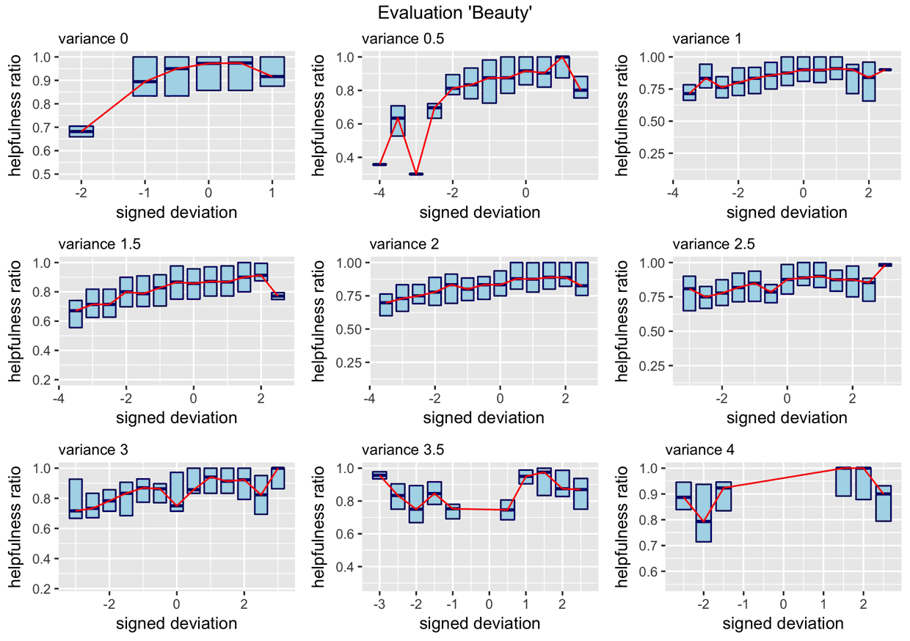

  

  <h3 align="center">Opinion-Mining and Meta-Opinion-Mining with Amazon-Reviewdata</h3>

  

    <a href="https://vbartelshske.github.io/)"><strong>Presentation of research results</strong></a>

 

##  Table of contents

1. [Data set](#data-set)
2. [Tools & setup](#tools--setup)
3. [Hypothesis](#hypothesis)
   1. [Brilliant but cruel](#brilliant-but-cruel)
   2. [Conformity](#conformity)
   3. [Individual-Bias](#individual-bias)
   4. [Text quality](#text-quality)
4. [Power law](#power-law)
   1. [Textlength](#textlength)
   2. [Total Votes](#total-votes)
   3. [Helpful Voters](#helpful-voters)
5. [Analysis of the most used words](#analysis-of-the-most-used-words)
   1. [Wordcloud](#wordcloud)    
   2. [Barplot](#barplot)
6. [Creators](#creators)
7. [License](#licence)

## Data set

Made possible with data from Julian McAuley. Analysis of the following categories:

*   [CDs and Vinyl](./images/cds-vinyl)
*   [Clothing, Shoes and Jewelry](./images/clothing-shoes-jewelry)
*   [Home and Kitchen](./images/home-kitchen)
*   [Kindle Store](./images/kindle_store)
*   [Sports and Outdoors](./images/sports-outdoors)
*   [Cell Phones and Accessories](./images/cell_phones-accessories)
*   [Health and Personal Care](./images/health-personal_care)
*   [Toys and Games](./images/toys-games)
*   [Video Games](./images/video_games)
*   [Tools and Home Improvement](./images/tools-home_improvement)
*   [Beauty](./images/beauty)
*   [Apps for Android](./images/apps_for_android)
*   [Books](./images/books)
*   [Office Products](./images/office_products)
*   [Pet Supplies](./images/pet_supplies)
*   [Automotive](./images/automotive)
*   [Grocery and Gourmet Food](./images/grocery-gourmet_food)
*   [Patio, Lawn and Garden](./images/patio-lawn-garden)
*   [Baby](./images/baby)
*   [Digital Music](./images/digital_music)
*   [Musical Instruments](./images/musical_instruments)
*   [Amazon Instant Video](./images/amazon_instant_video)

## Tools & setup

To get started you need to install the latest R language packge and the R-compatible IDE of your choice. We suggest you use RStudio. 

## Hypothesis

### Brilliant but cruel

### Conformity

### Individual-Bias 

### Text quality

## Power law

### Textlength

### Total Votes

### Helpful Voters

## Analysis of the most used words

### Wordcloud

### Barplot

    //ich bin etwas Code
    int i = 0;
    i++;
    
    
 
 ## Creators
 
 ## Licence
