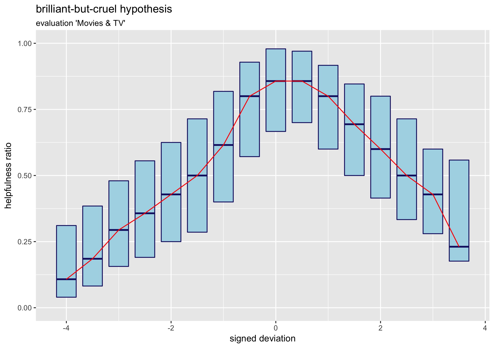
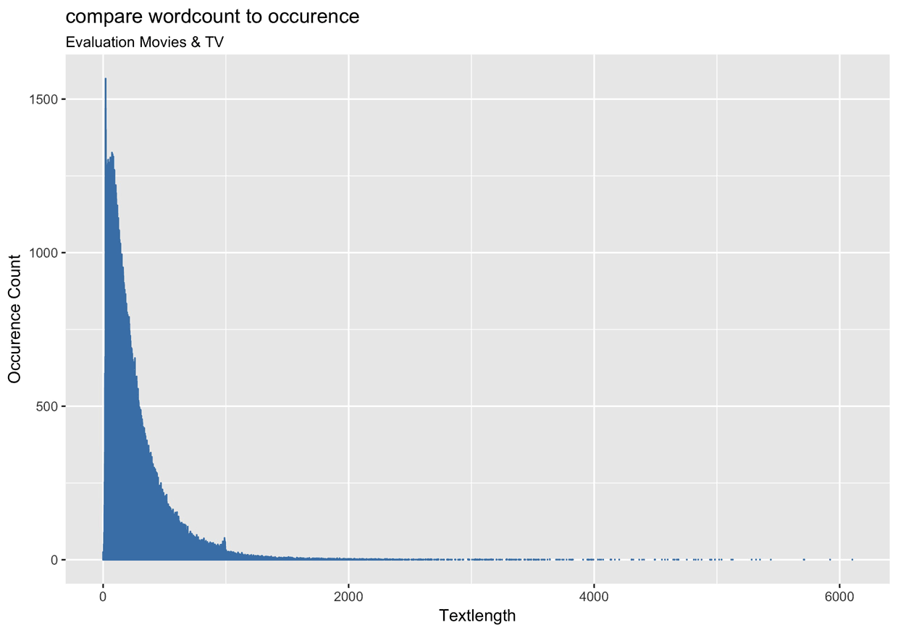
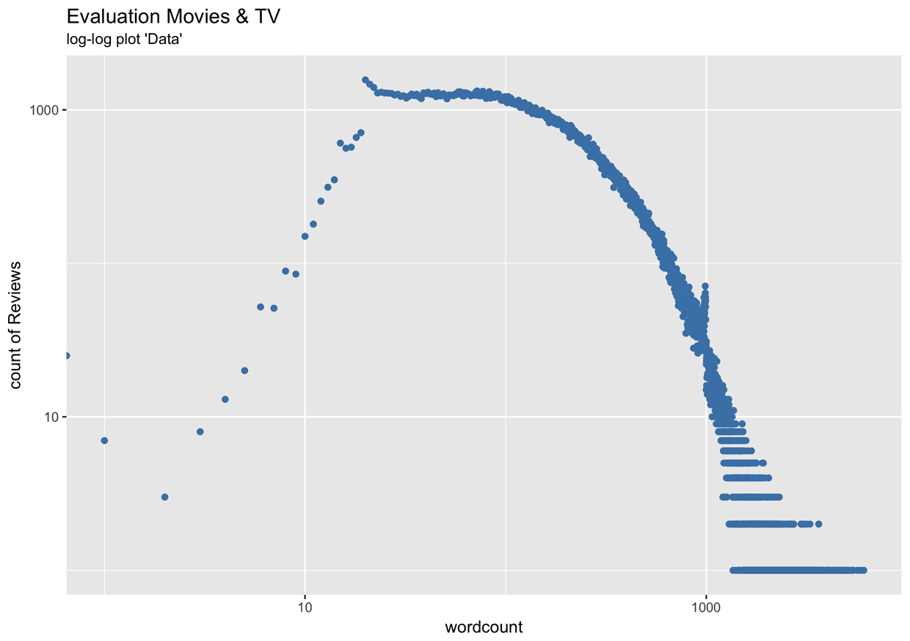
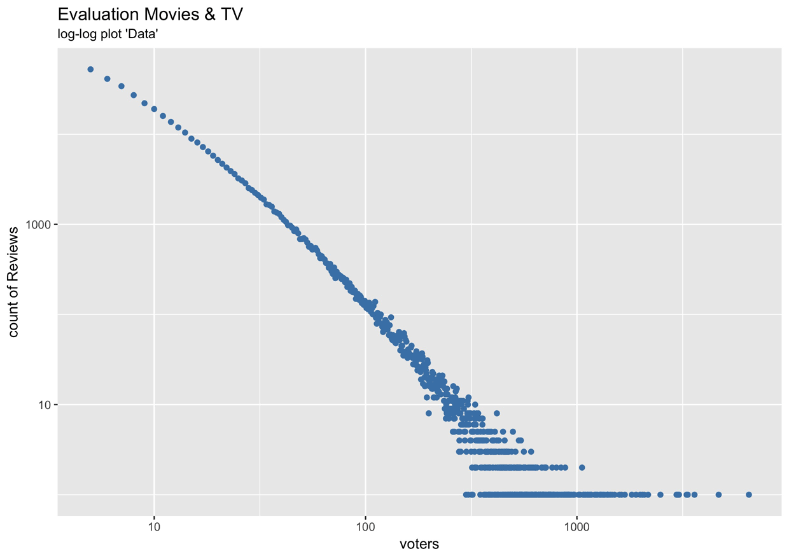
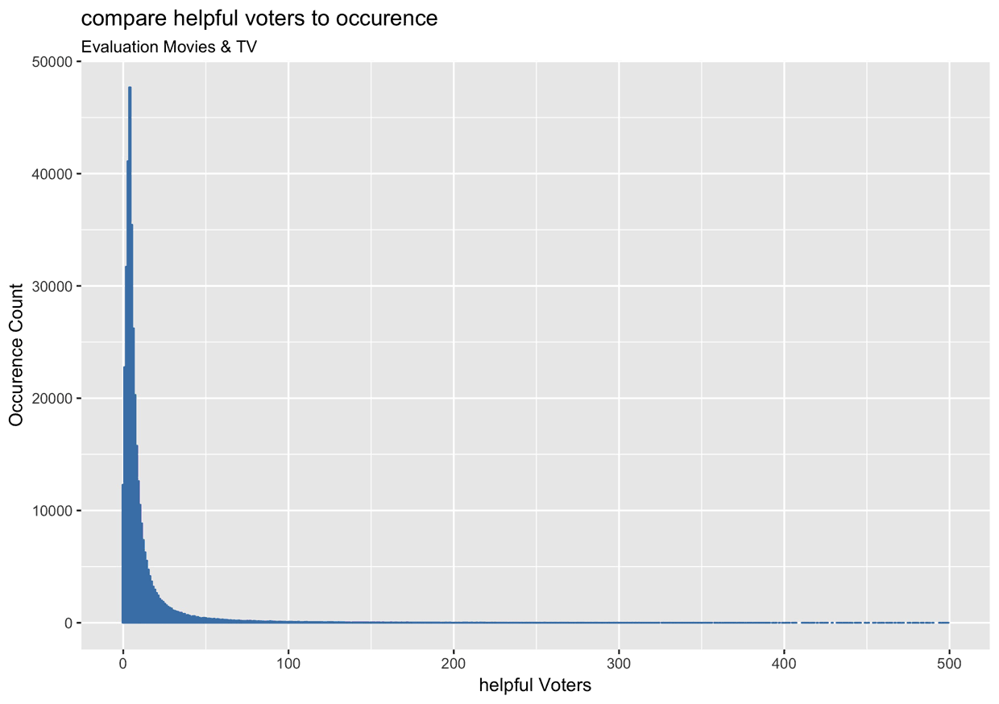

# Movies and TV
All results for category movies and TV.

##  Table of contents

1. [Hypothesis](#hypothesis)
    1. [Brilliant but cruel](#brilliant-but-cruel)
    2. [Conformity](#conformity)
    3. [Individual-Bias](#individual-bias)
    4. [Text quality](#text-quality)
2. [Power law](#power-law)
    1. [Textlength](#textlength)
    2. [Total Votes](#total-votes)
    3. [Helpful Voters](#helpful-voters)
3. [Analysis of the most used words](#analysis-of-the-most-used-words)
    1. [Wordcloud](#wordcloud)    
    2. [Barplot](#barplot)

## Hypothesis

### Brilliant but cruel

### Conformity

### Individual-Bias

### Text quality

#### Scatterplot

#### Boxplot

## Power law

### Textlength

### Total Votes

### Helpful Voters

## Analysis of the most used words

### Wordcloud

### Barplot

